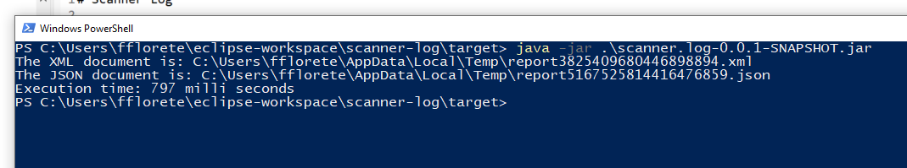
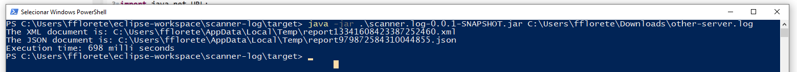

# Scanner Log

**Welcome!**

This is the Scanner Log application. It will generate XML and JSON file with a report of server.log file. 

## Pre requisites

- To run the application it's necessary use Java 11 or above;

## Run application

- Clone this project or just download [deploy/scanner-log-0.0.1.jar](here)
- Go to the same folder where is .jar file and execute: `java -jar scanner-log-0.0.1.jar`
- It should apper an output like the image below: 

 

## Extras

- If you want to generate a report with different **server.log**, you can run: `java -jar scanner-log-0.0.1.jar /path/of/other/server.log` 

## Workspace configuration

- Clone the project;
- Import it on your IDE, I used Eclipse;
- Execute: `mvn clean install`